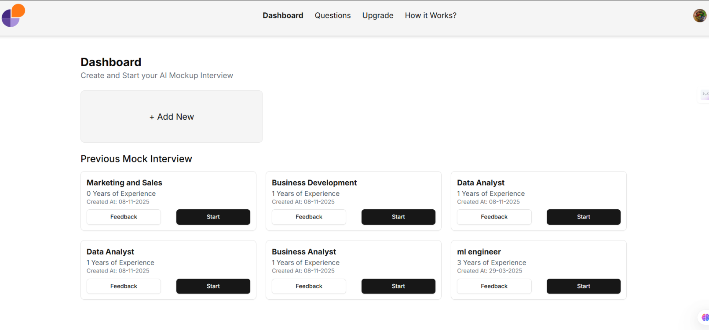
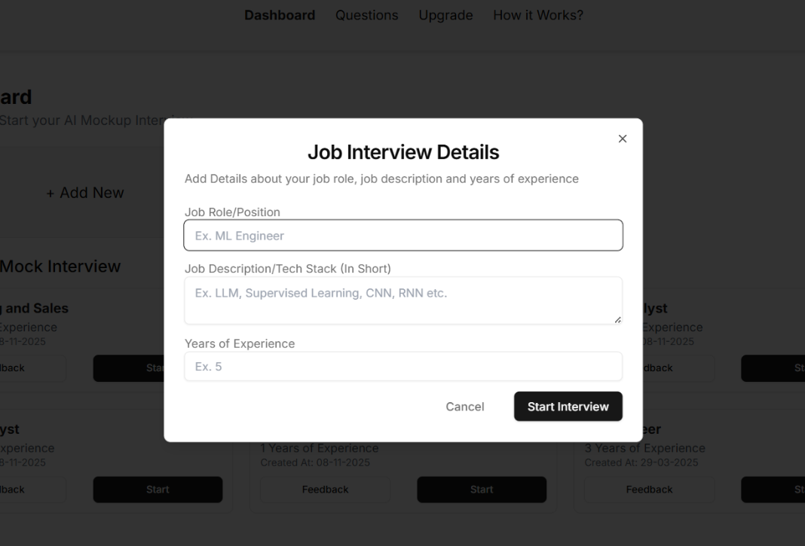
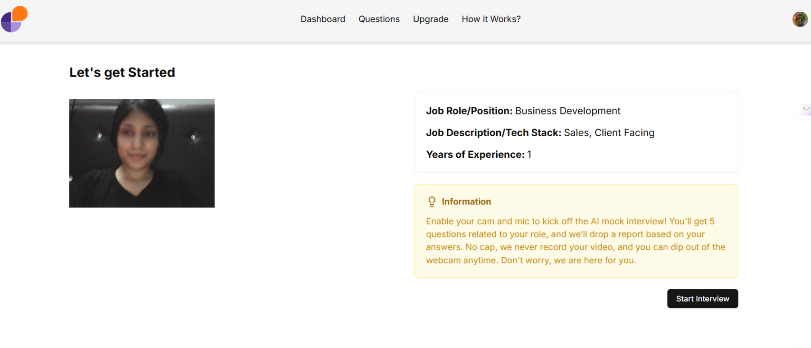
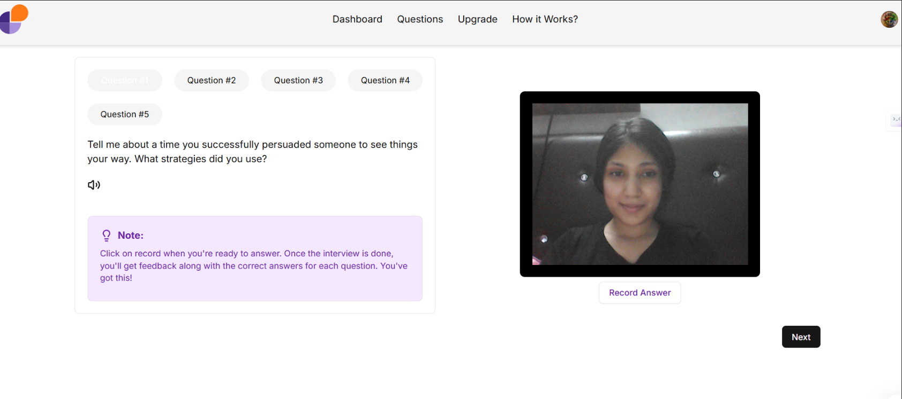
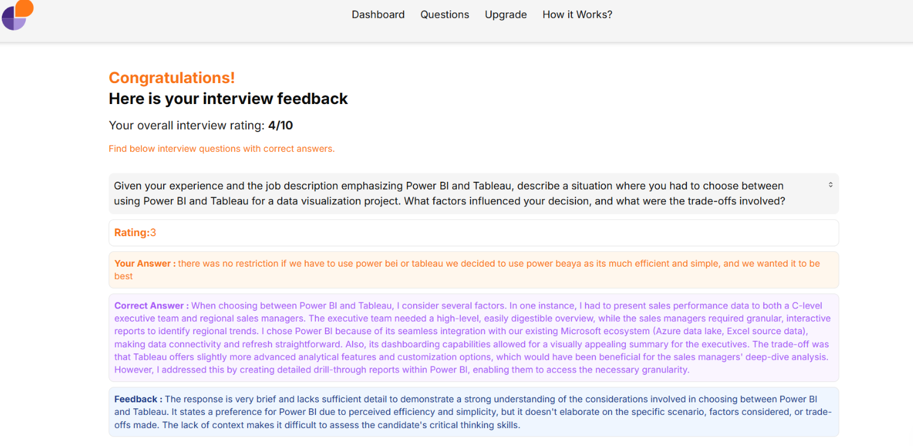

# AI Mock Interview Assistant 🎙️🤖

A voice-based AI-powered mock interview system that generates role-specific technical questions, evaluates candidate responses using LLM APIs, and provides intelligent, instant feedback—designed to simulate real-world interview experiences.

> 🚧 Currently in production with ongoing feature improvements and real-user testing.

---

## 🚀 Features

- 🎯 **Role-Specific Interviews**: Automatically generates technical questions tailored to specific job roles.
- 🧠 **LLM-Powered Evaluation**: Uses custom prompts and the Gemini API to evaluate responses and provide detailed feedback.
- 📊 **Scoring Mechanism**: Implements structured scoring logic that mimics human interviewer behavior.
- 🔐 **Secure Login**: Google authentication for secure and seamless access.
- 📈 **Real-Time Analysis**: Captures and processes voice input with live response tracking.
- 🌐 **Scalable Architecture**: Built with future scalability and multi-user support in mind.

## 🛠️ Tech Stack

- **LLM API**: Gemini
- **Backend**: PostgreSQL, Drizzle ORM
- **Frontend**: React.js, Tailwind CSS
- **Authentication**: Clerk with Google Sign-In
- **Others**: Prompt Engineering, Real-time response analysis

## Images







## 🧩 How It Works

1. **User logs in** using Google authentication.
2. **Selects a job role**, which triggers the prompt logic.
3. **LLM API generates** custom technical questions.
4. **User responds** via voice input.
5. System **evaluates the response** using predefined prompt rules and structured scoring.
6. **Feedback & score** are returned instantly, mimicking a human interviewer's review.

## 📌 Prompt Engineering

A custom-designed prompt template is sent to the LLM. It includes:
- Role description
- Question generation logic
- Evaluation criteria (clarity, correctness, depth)
- Scoring instructions
- Feedback style (human-like tone)

## 🚀 Deployment & Status

- ✅ **Currently in production**
- 🧪 Actively undergoing **user testing** and **feedback integration**
- 📈 Built with **scalability and modularity** for future enterprise deployment

## 📈 Impact

- Supports mock interviews for **98% of job roles**.
- Designed to help users **improve response quality** and **build confidence** before real interviews.
- Enables companies or platforms to scale mock interviews using AI with minimal human effort.

## 🧪 Future Improvements

- Integration of resume parsing for contextual questions.
- More voice input enhancements.
- Personalized learning paths based on performance trends.

## 📬 Contact

For queries or collaboration, feel free to reach out to me on [LinkedIn](https://www.linkedin.com/in/anusha3768) or email: anushadhiman101@gmail.com.

---


This is a [Next.js](https://nextjs.org/) project bootstrapped with [`create-next-app`](https://github.com/vercel/next.js/tree/canary/packages/create-next-app).

## Getting Started

First, run the development server:

```bash
npm run dev
# or
yarn dev
# or
pnpm dev
# or
bun dev
```

Open [http://localhost:3000](http://localhost:3000) with your browser to see the result.
